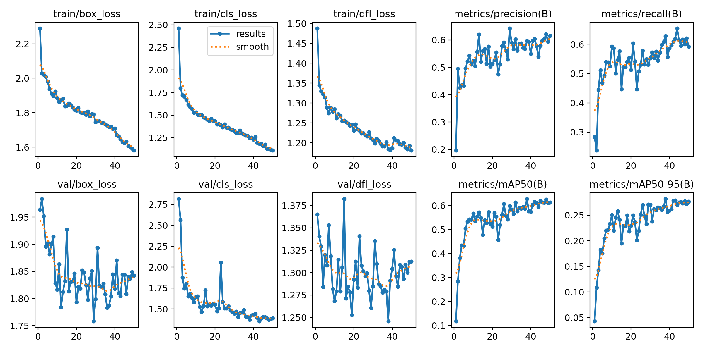
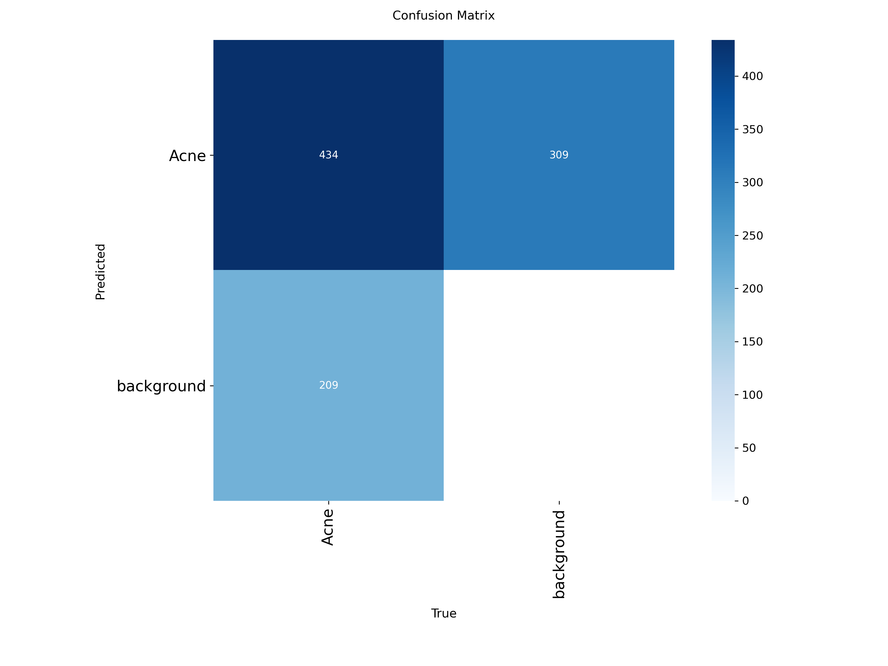
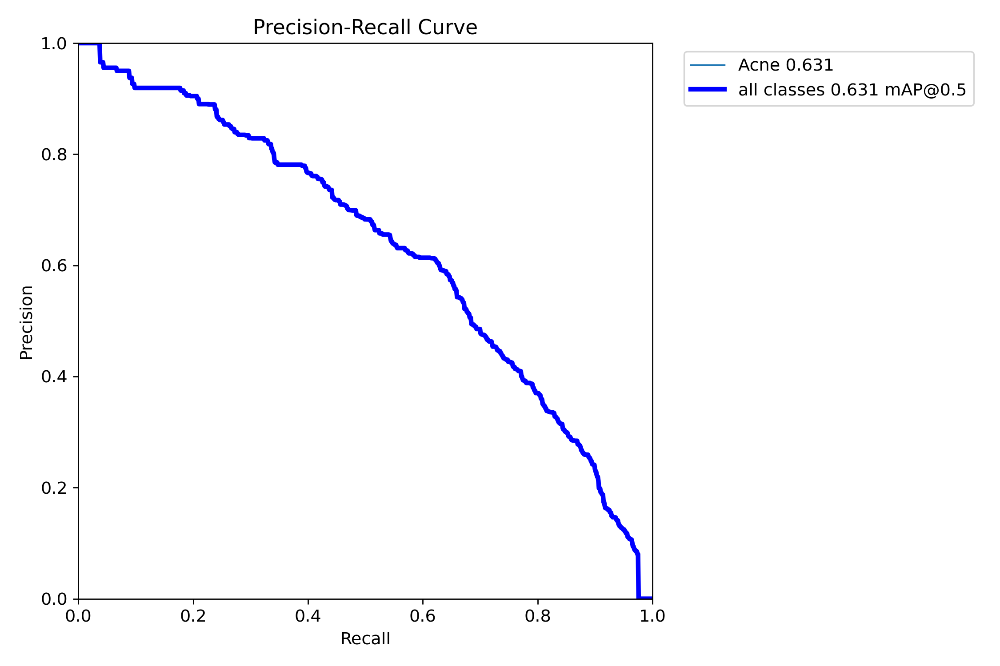
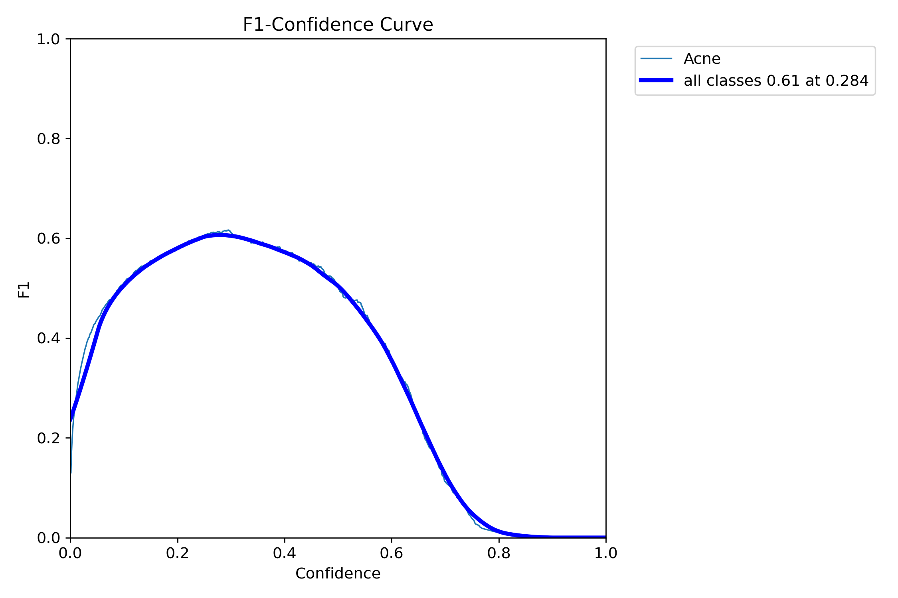
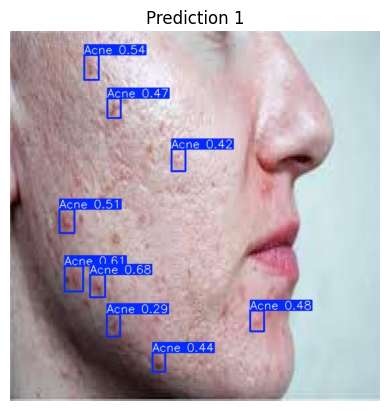
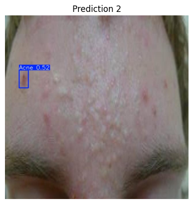
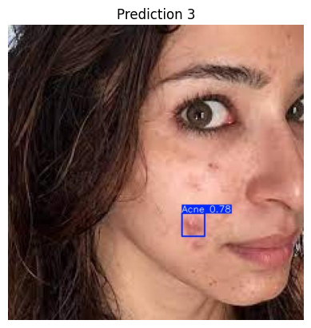
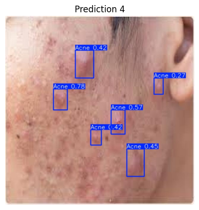
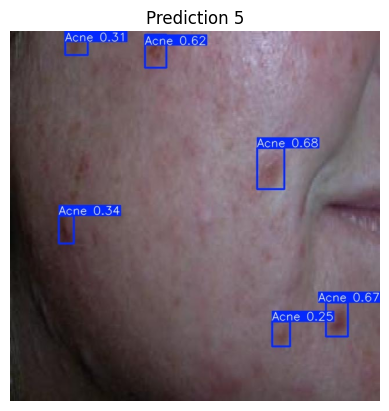

# Acne Detection System using YOLOv8

## Overview

This project presents an end-to-end computer vision pipeline for detecting acne regions from facial images using the YOLOv8 object detection framework. The system is designed to identify acne spots in real-world images and provide confidence-based predictions, with a focus on efficiency and real-time applicability.

The model is trained on a publicly available dataset in YOLO format and optimized to balance detection accuracy with inference speed. The project demonstrates the complete workflow of dataset handling, preprocessing, model training, evaluation, and inference.

## Problem Statement

Acne is one of the most common dermatological conditions, affecting individuals across age groups. Manual diagnosis can be subjective and time-consuming. This project aims to explore how computer vision can assist in:

* Automated detection of acne regions in images
* Providing consistent and objective analysis
* Enabling scalable solutions for dermatological screening

## Approach

The project follows a structured machine learning pipeline:

1. Dataset acquisition and inspection
2. Data preprocessing and configuration
3. Model training using YOLOv8 Nano
4. Evaluation using standard object detection metrics
5. Inference and visualization of predictions

A lightweight YOLOv8 Nano model was selected to ensure faster inference while maintaining reasonable detection performance.

## Dataset

The dataset used is a publicly available acne detection dataset in YOLO format.

* Contains annotated facial images with bounding boxes around acne regions
* Organized into training, validation, and test sets
* Single-class detection problem (Acne vs Background)

A preprocessing step was required to correct dataset paths in the YAML configuration to ensure compatibility with the training environment.

## Model and Training

* Model: YOLOv8 Nano (Ultralytics)
* Training epochs: 50
* Image size: 640 × 640
* Batch size: 16
* Hardware: Tesla T4 GPU

The model was trained to detect acne regions using bounding boxes and confidence scores. Training performance was monitored through loss curves and validation metrics.

## Results

The model achieved the following performance:

* mAP@50: 0.623
* mAP@50-95: 0.282
* Precision: 0.579
* Recall: 0.632
* F1-score: 0.61 at confidence threshold ≈ 0.28

These results indicate that the model is able to detect acne regions with moderate accuracy while maintaining balanced precision and recall.

## Evaluation

Model performance was analyzed using multiple evaluation techniques:

* Precision-Recall Curve to study trade-offs between precision and recall
* Confusion Matrix to analyze false positives and missed detections
* F1-Score Curve to identify the optimal confidence threshold
* Loss Curves to monitor convergence during training

Training Results

Confusion Matrix

Precision-Recall Curve

F1 Score Curve

## Inference and Performance

The trained model was tested on unseen images to evaluate real-world performance.

* Average inference time: ~11–16 ms per image
* Supports near real-time detection
* Outputs include:

  * Bounding boxes
  * Confidence scores
  * Detected acne regions

## Sample prediction images with bounding boxes

## Key Insights

* The model performs well for general acne detection but struggles with very small or low-contrast regions
* Some false positives occur due to similarity between acne and normal skin textures
* Performance is limited by dataset size and single-class labeling
* Detection accuracy can be improved with more diverse and high-quality data

## Applications

This system has potential applications in:

* Dermatology assistance tools
* Mobile health applications
* Skincare analysis platforms
* Telemedicine systems

It can serve as a foundational step toward automated skin condition analysis.

## Limitations

* Single-class detection (does not classify acne types)
* Limited dataset diversity
* Reduced accuracy for small or subtle acne regions
* Sensitivity to lighting and image quality

## Future Improvements

* Extend to multi-class acne classification (papules, pustules, etc.)
* Increase dataset size and diversity
* Apply data augmentation techniques
* Use larger YOLO models (YOLOv8m/l) for improved accuracy
* Deploy as a web or mobile application

## Conclusion

This project demonstrates the practical implementation of a real-time object detection system for acne detection using YOLOv8. It highlights the importance of data preprocessing, model evaluation, and performance optimization in building effective computer vision solutions.

The system provides a strong foundation for further development in AI-driven dermatological analysis and real-world healthcare applications.

